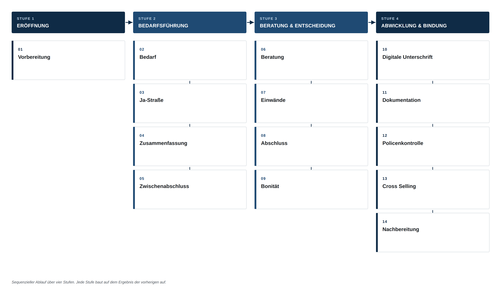
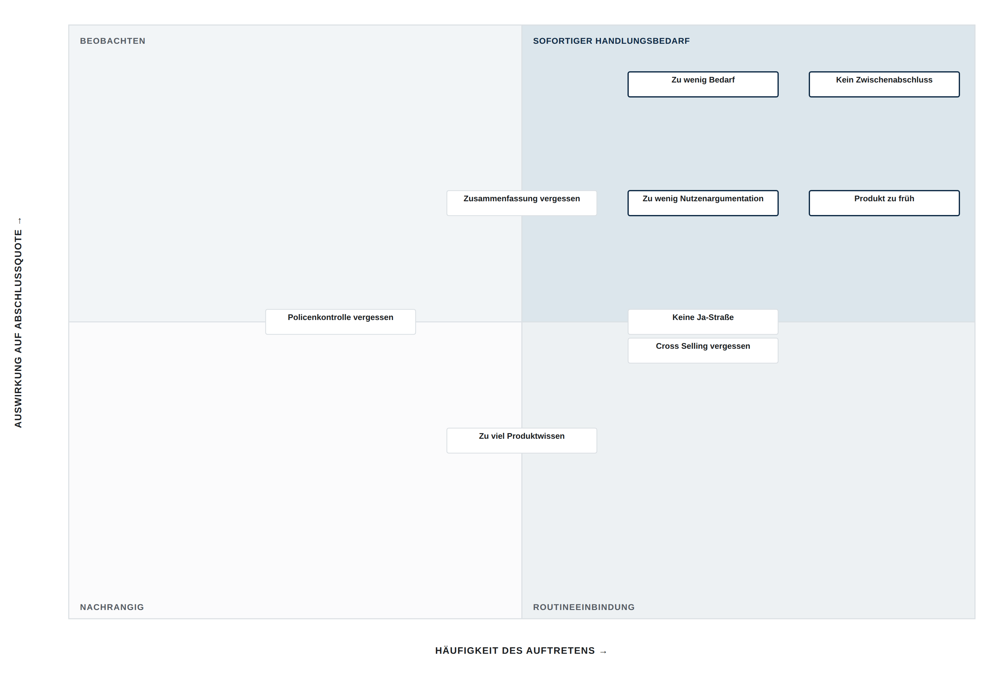
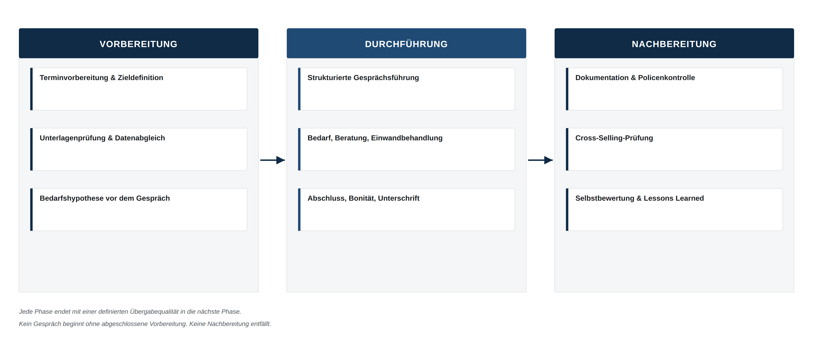
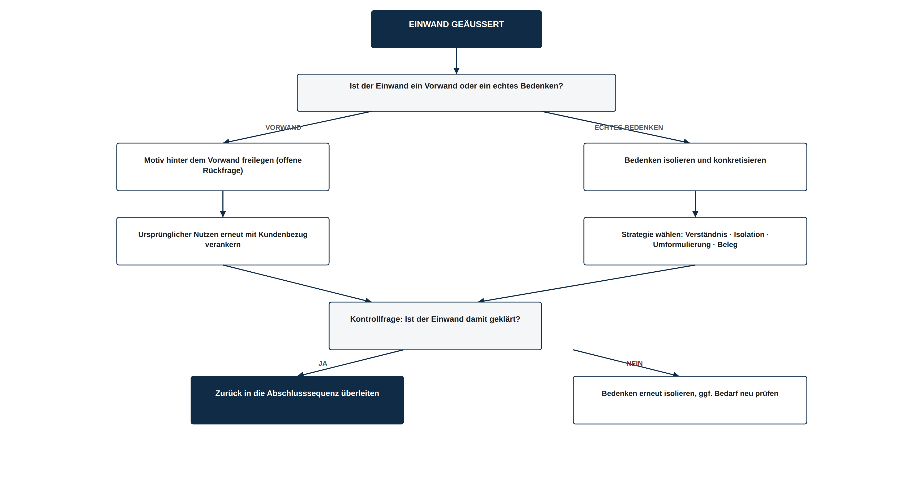
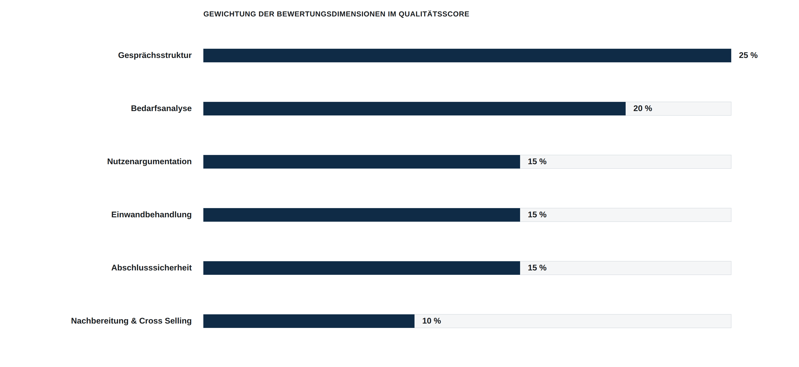
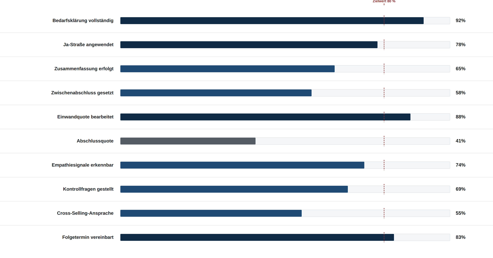
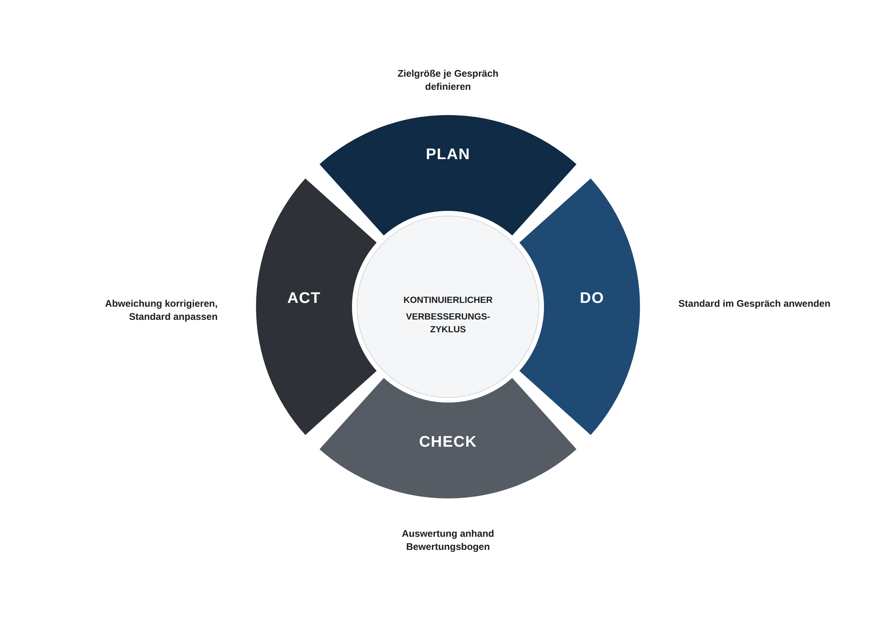
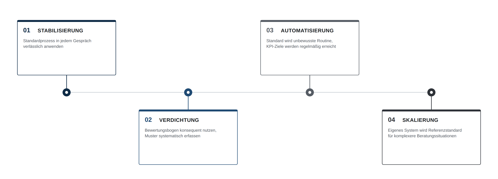

# VERTRIEBLICHE ENTWICKLUNGSSTRATEGIE
### Aufbau eines standardisierten Beratungssystems auf Basis systematischer Trainingsauswertung und kontinuierlicher Optimierung.
Version 1.0 · Dokumentstatus: Freigegeben · Klassifizierung: Intern · Stand: Juli 2026

---

## Dokumentkontrolle

| Feld | Angabe |
| --- | --- |
| Dokumenttitel | Vertriebliche Entwicklungsstrategie |
| Version | 1.0 |
| Status | Freigegeben |
| Klassifizierung | Intern |
| Geltungsbereich | Persönliches Beratungssystem im Versicherungsvertrieb |
| Aktualisierungszyklus | Quartalsweise, anlassbezogen bei Prozessänderung |
| Grundlage | Systematische Auswertung durchgeführter Beratungsgespräche und Trainingseinheiten |

### Änderungshistorie

| Version | Änderung | Status |
| --- | --- | --- |
| 1.0 | Erstveröffentlichung des standardisierten Beratungssystems | Freigegeben |

---

---

# Executive Summary

> Beratungsqualität im Versicherungsvertrieb ist kein Ergebnis von Talent oder Erfahrung allein. Sie ist das Ergebnis eines Systems – oder das Fehlen eines solchen.
Die meisten Beratungsgespräche im Versicherungsvertrieb verlaufen situativ. Der Gesprächsverlauf hängt von der Tagesform, der Reaktion des Kunden und der spontanen Entscheidung des Beraters ab, welcher Schritt als nächstes sinnvoll erscheint. Dieses Vorgehen erzeugt Schwankung: Die Ergebnisqualität eines Beraters unterscheidet sich von Gespräch zu Gespräch stärker als zwischen unterschiedlichen Beratern. Schwankung ist der eigentliche Gegner nachhaltiger Vertriebsleistung – nicht fehlendes Fachwissen.
Dieses Dokument beschreibt ein standardisiertes Beratungssystem, das aus der systematischen Auswertung durchgeführter Beratungsgespräche und Trainingseinheiten entwickelt wurde. Es ersetzt situative Entscheidungen durch einen wiederholbaren Ablauf, ersetzt Bauchgefühl durch Kennzahlen und ersetzt punktuelle Verbesserung durch einen kontinuierlichen Regelkreis.

## Warum dieses System entwickelt wurde

Einzelne Trainingsmaßnahmen erzeugen kurzfristige Verbesserung, die ohne strukturelle Verankerung wieder abklingt. Wissen über Gesprächstechnik ist in der Regel vorhanden; die Lücke liegt in der Anwendung unter Gesprächsdruck. Ein System schließt diese Lücke, indem es die Anwendung nicht dem Moment überlässt, sondern in einen festen Ablauf mit definierten Kontrollpunkten überführt.

## Welches Problem gelöst wird

- Beratungsergebnisse sind von Gespräch zu Gespräch nicht vorhersehbar.
- Fehler wiederholen sich unerkannt, weil sie nicht systematisch erfasst werden.
- Verbesserung erfolgt zufällig statt planmäßig.
- Qualität wird subjektiv beurteilt statt anhand nachvollziehbarer Kriterien gemessen.

## Welche Wirkung erreicht werden soll

Das System soll die Streuung der Beratungsqualität reduzieren und die Wahrscheinlichkeit erhöhen, dass jedes Gespräch – unabhängig von Tagesform und Kundentyp – eine definierte Mindeststruktur durchläuft. Erfolg wird dabei nicht an Einzelergebnissen gemessen, sondern an der Konstanz, mit der der Standard eingehalten wird. Konstanz erzeugt Vorhersehbarkeit. Vorhersehbarkeit erzeugt Skalierbarkeit.

> **LEITPRINZIPIEN DES SYSTEMS**
> 1. Struktur vor Intuition – jedes Gespräch folgt einem definierten Ablauf, unabhängig von der Situation.
> 2. Messung vor Meinung – Qualität wird anhand von Kriterien bewertet, nicht anhand von Eindrücken.
> 3. Muster vor Einzelfall – Fehler werden als wiederkehrende Kategorie behandelt, nicht als Einzelereignis.
> 4. Wiederholung vor Perfektion – der Standard wird durch konsequente Anwendung robust, nicht durch einmalige Optimierung.

---

# 01  Sales Operating System

> Ein Beratungsgespräch ist kein freies Gespräch mit Verkaufsabsicht. Es ist ein Prozess mit vierzehn Stationen, deren Reihenfolge die Wahrscheinlichkeit eines für beide Seiten richtigen Abschlusses bestimmt.
Der Begriff „Operating System“ ist bewusst gewählt. Ein Betriebssystem verwaltet Ressourcen nach festen Regeln, unabhängig davon, welche Anwendung gerade läuft. Übertragen auf die Beratung bedeutet das: Unabhängig davon, welches Produkt, welcher Kunde und welche Ausgangslage vorliegt, durchläuft das Gespräch dieselbe Sequenz von Stufen. Die Inhalte innerhalb jeder Stufe variieren – die Reihenfolge der Stufen nicht.
Vier Stufen bündeln die vierzehn Stationen zu einer nachvollziehbaren Architektur. Jede Stufe hat ein eigenes Ziel und einen eigenen Abschlusszustand, der erreicht sein muss, bevor die nächste Stufe beginnt.

*Abbildung 1 — Sales Operating System: vierzehn Stationen in vier Stufen*

## Die vier Stufen im Überblick

| Stufe | Ziel der Stufe | Abschlusszustand |
| --- | --- | --- |
| 1 · Eröffnung | Gesprächsrahmen und Zielbild vor dem ersten Kundenkontakt festlegen | Gesprächsziel, Unterlagen und Bedarfshypothese liegen vor |
| 2 · Bedarfsführung | Bedarf herausarbeiten und Zustimmungsbereitschaft aufbauen | Kunde bestätigt Bedarf aktiv und nachvollziehbar |
| 3 · Beratung & Entscheidung | Lösung präsentieren, Einwände klären, Entscheidung herbeiführen | Kunde trifft eine informierte Entscheidung |
| 4 · Abwicklung & Bindung | Entscheidung rechtssicher umsetzen und Beziehung ausbauen | Vertrag korrekt dokumentiert, Folgekontakt vereinbart |

## Warum die Reihenfolge nicht verhandelbar ist

Jede Station baut auf dem Ergebnis der vorherigen auf. Eine Beratung ohne vorherige Bedarfsklärung ist Produktpräsentation ohne Fundament. Ein Abschlussversuch ohne vorherige Ja-Straße ist eine Forderung ohne Vorbereitung. Wird eine Station übersprungen, verschiebt sich die fehlende Wirkung nicht – sie geht verloren und muss an späterer Stelle mit höherem Aufwand kompensiert werden, meist in Form von Einwänden, die bei korrekter Reihenfolge nicht entstanden wären.

> **KERNAUSSAGE**
> Die Reihenfolge der Stationen ist kein didaktisches Hilfsmittel, sondern der eigentliche Wirkmechanismus des Systems. Wer die Reihenfolge beherrscht, benötigt weniger Verkaufsdruck.

---

# 02  Psychologie hinter jeder Phase

> Jede Station des Sales Operating Systems nutzt einen belegten Mechanismus der Entscheidungspsychologie. Wer die Technik anwendet, ohne den Mechanismus zu verstehen, verliert die Technik bei der ersten Abweichung vom Skript.
Dieses Kapitel erklärt nicht, was in den einzelnen Stationen zu tun ist – das ist Gegenstand von Kapitel 4 und 5. Es erklärt, warum diese Stationen wirken. Die Grundlage bilden Verhaltensökonomie, Kaufpsychologie und Entscheidungsforschung, nicht vertriebliche Faustregeln.

### Die Ja-Straße: Prinzip der Konsistenz

Menschen streben danach, ihr Verhalten mit früheren Aussagen und Entscheidungen in Einklang zu halten – ein Effekt, den die Verhaltenspsychologie als Konsistenzprinzip beschreibt. Eine Serie kleiner, wahrheitsgemäßer Zustimmungen zu Beginn eines Gesprächs erzeugt eine psychologische Selbstverpflichtung: Der Kunde beginnt, sich selbst als jemanden wahrzunehmen, der dieser Beratung zustimmt. Eine spätere, größere Zustimmung – der Abschluss – fügt sich in dieses Selbstbild ein, statt ihm zu widersprechen. Ohne Ja-Straße trifft der Abschluss auf keinerlei inneren Vorlauf und wird als Bruch, nicht als Fortsetzung wahrgenommen.

### Der Zwischenabschluss: Reduktion kognitiver Überforderung

Eine einzige, am Gesprächsende gestellte Abschlussfrage verlangt vom Kunden, sämtliche im Gespräch gesammelten Informationen gleichzeitig zu bewerten. Das erzeugt kognitive Überforderung und begünstigt die naheliegendste Antwort: Aufschub. Der Zwischenabschluss zerlegt die finale Entscheidung in mehrere kleinere Bewertungsschritte während des Gesprächs. Jede Teilentscheidung wird mit begrenztem Aufwand getroffen, wodurch die Entscheidungslast am Ende sinkt. Dieser Effekt ist in der Entscheidungsforschung als Vermeidung von Entscheidungsermüdung (decision fatigue) belegt.

### Die Zusammenfassung: Verfügbarkeitsheuristik

Menschen bewerten Sachverhalte nicht anhand aller verfügbaren Informationen, sondern anhand dessen, was im Moment der Entscheidung gedanklich am leichtesten abrufbar ist – die Verfügbarkeitsheuristik. Eine mündliche Zusammenfassung kurz vor der Entscheidung rückt die relevanten Nutzenargumente an die letzte Stelle des Kurzzeitgedächtnisses und erhöht ihre Abrufbarkeit im Entscheidungsmoment. Fehlt die Zusammenfassung, entscheidet der Kunde auf Basis dessen, was zufällig zuletzt im Gespräch betont wurde – oft ein Einwand, kein Nutzenargument.

### Kundenbindung: Endowment-Effekt und sozialer Beweis

Sobald ein Kunde beginnt, eine Lösung gedanklich als „seine“ Lösung zu behandeln, steigt ihre subjektive Wertschätzung unabhängig vom objektiven Nutzen – der Endowment-Effekt. Formulierungen, die den Kunden bereits als Inhaber der Lösung ansprechen („Ihr Vertrag“, „Ihre Absicherung“), beschleunigen diesen Übergang von Prüfung zu Besitz. Ergänzend wirkt sozialer Beweis: Der Hinweis auf vergleichbare, bereits getroffene Entscheidungen anderer Kunden reduziert wahrgenommenes Risiko, ohne Druck zu erzeugen.

### Kontrollfragen: Sicherstellung echten Verständnisses

Zustimmung ist nicht gleichbedeutend mit Verständnis. Kunden bestätigen im Gesprächsverlauf häufig aus Höflichkeit oder um den Gesprächsfluss nicht zu unterbrechen – ein Effekt, der in der Kommunikationsforschung als soziale Erwünschtheit beschrieben wird. Kontrollfragen unterbrechen diesen Automatismus gezielt, indem sie den Kunden zur aktiven Reproduktion des Inhalts zwingen. Nur reproduziertes Verständnis ist tragfähig genug, um einen späteren Einwand oder eine Stornierung zu verhindern.

### Einwandbehandlung: Kognitive Dissonanz auflösen

Ein Einwand ist in den meisten Fällen keine Ablehnung, sondern ein Signal für kognitive Dissonanz – der Kunde erkennt einen Nutzen, empfindet aber gleichzeitig ein ungelöstes Risiko oder einen Kontrollverlust. Die Dissonanz wird nicht durch Gegenargumentation aufgelöst, da diese die Position des Kunden angreift und Reaktanz auslöst, sondern durch Isolation und Anerkennung: Das Bedenken wird als eigenständig und berechtigt benannt, bevor es eingeordnet wird. Erst wenn sich der Kunde verstanden fühlt, ist er bereit, die eigene Position zu revidieren.

> **KERNAUSSAGE**
> Keine Station des Systems wirkt durch Wiederholung von Formulierungen. Jede Station wirkt, weil sie einen belegten psychologischen Mechanismus gezielt auslöst. Formulierungen sind austauschbar – der Mechanismus ist es nicht.

---

# 03  Analyse typischer Gesprächsfehler

> Nicht der einzelne Fehler ist relevant. Relevant ist das Muster, das sich hinter wiederkehrenden Fehlern verbirgt – denn nur Muster lassen sich systematisch abstellen.
Die folgende Analyse ist bewusst personenunabhängig aufgebaut. Sie beschreibt neun Fehlermuster, die in der Auswertung von Beratungsgesprächen wiederkehrend auftreten, unabhängig davon, wer das Gespräch führt. Jedes Muster wird in fünf Dimensionen zerlegt: das beobachtbare Symptom, die dahinterliegende Ursache, die Auswirkung auf das Gesprächsergebnis, die Optimierungsmaßnahme und der Mechanismus, der ein erneutes Auftreten verhindert.

### Muster 1 — Produkt zu früh eingeführt

- **Symptom:** Das Produkt wird genannt, bevor der Bedarf durch den Kunden selbst bestätigt wurde.
- **Ursache:** Sicherheit durch Fachwissen wird höher bewertet als Sicherheit durch Prozessdisziplin; das Produkt fühlt sich als „sicherer“ Gesprächsinhalt an als offene Fragen.
- **Auswirkung:** Die Beratung wirkt verkaufsgetrieben statt bedarfsgetrieben. Der Kunde bewertet das Angebot, bevor er den eigenen Bedarf anerkannt hat – Einwände entstehen als Abwehrreaktion.
- **Optimierungsmaßnahme:** Verbindliche Reihenfolge: Produktnennung erst nach durch den Kunden verbal bestätigtem Bedarf.
- **Präventionsmechanismus:** Checkliste vor Beratungsbeginn: Bedarfsbestätigung liegt schriftlich oder mündlich dokumentiert vor.

### Muster 2 — Zu wenig Bedarf erarbeitet

- **Symptom:** Die Bedarfsanalyse wird nach ein bis zwei Fragen als abgeschlossen behandelt.
- **Ursache:** Zeitdruck oder die Annahme, der Bedarf sei aus Vorunterlagen bereits bekannt.
- **Auswirkung:** Die Nutzenargumentation trifft nicht den tatsächlichen Beweggrund des Kunden und verfehlt emotionale Relevanz. Der Abschluss basiert auf Vermutung statt Bestätigung.
- **Optimierungsmaßnahme:** Mindestanzahl vertiefender Fragen je Bedarfsfeld festlegen, bevor zur Lösung übergegangen wird.
- **Präventionsmechanismus:** Strukturierter Fragenkatalog mit Pflichtfeldern, die vor Gesprächsfortsetzung auszufüllen sind.

### Muster 3 — Keine Ja-Straße aufgebaut

- **Symptom:** Das Gespräch springt direkt von der Begrüßung in die inhaltliche Bedarfsklärung.
- **Ursache:** Ja-Straßen werden als Zeitverlust statt als Wirkmechanismus wahrgenommen.
- **Auswirkung:** Dem Abschluss fehlt der psychologische Vorlauf aus Kapitel 2; die Zustimmungsbereitschaft muss am Gesprächsende vollständig neu aufgebaut werden.
- **Optimierungsmaßnahme:** Mindestens drei kleine, wahrheitsgemäße Zustimmungen vor Beginn der inhaltlichen Bedarfsklärung einbauen.
- **Präventionsmechanismus:** Gesprächsleitfaden mit fest hinterlegten Ja-Straßen-Fragen zu Gesprächsbeginn.

### Muster 4 — Zusammenfassung vergessen

- **Symptom:** Das Gespräch geht ohne Rekapitulation der besprochenen Nutzenargumente direkt in die Abschlussfrage über.
- **Ursache:** Die Zusammenfassung wird als Wiederholung empfunden und daher als überflüssig eingestuft.
- **Auswirkung:** Die Verfügbarkeitsheuristik aus Kapitel 2 wirkt zulasten des Beraters: Der zuletzt genannte Punkt bestimmt die Entscheidung, unabhängig von dessen Relevanz.
- **Optimierungsmaßnahme:** Feste Gesprächsstation unmittelbar vor jedem Abschlussversuch: strukturierte Zusammenfassung der drei wichtigsten Nutzenargumente.
- **Präventionsmechanismus:** Abschlussfrage ist im Leitfaden strukturell an eine vorherige Zusammenfassung gekoppelt.

### Muster 5 — Kein Zwischenabschluss gesetzt

- **Symptom:** Erst am Gesprächsende erfolgt eine einzige, umfassende Abschlussfrage.
- **Ursache:** Zwischenabschlüsse werden als aufdringlich empfunden oder ihr Nutzen ist nicht bekannt.
- **Auswirkung:** Die gesamte Entscheidungslast konzentriert sich auf einen Moment; die Wahrscheinlichkeit von Aufschub steigt überproportional.
- **Optimierungsmaßnahme:** Nach jeder inhaltlich abgeschlossenen Gesprächseinheit eine kleine, unverbindliche Kontrollfrage stellen.
- **Präventionsmechanismus:** Standardformulierungen für Zwischenabschlüsse in jeder Gesprächsphase hinterlegen.

### Muster 6 — Zu viel Produktwissen kommuniziert

- **Symptom:** Fachliche Details werden in einer Tiefe erläutert, die über den Entscheidungsbedarf des Kunden hinausgeht.
- **Ursache:** Fachkompetenz wird mit Gesprächsqualität verwechselt; Detailwissen dient der eigenen Absicherung, nicht dem Kundennutzen.
- **Auswirkung:** Kognitive Überforderung des Kunden, Verlust der emotionalen Gesprächsführung, Verwässerung der Kernbotschaft.
- **Optimierungsmaßnahme:** Information auf Entscheidungsrelevanz filtern; Detailtiefe nur auf explizite Nachfrage erhöhen.
- **Präventionsmechanismus:** Vorbereitung enthält pro Produkt maximal drei entscheidungsrelevante Kernaussagen.

### Muster 7 — Zu wenig Nutzenargumentation

- **Symptom:** Produktmerkmale werden benannt, ohne sie auf die zuvor erhobene Bedarfslage zu übersetzen.
- **Ursache:** Merkmal und Nutzen werden inhaltlich nicht unterschieden.
- **Auswirkung:** Der Kunde muss die Übersetzungsarbeit selbst leisten und bricht diesen kognitiven Aufwand häufig ab.
- **Optimierungsmaßnahme:** Jedes Merkmal verbindlich mit einer Formulierung „das bedeutet für Sie …“ an den Bedarf koppeln.
- **Präventionsmechanismus:** Nutzenformulierung ist fester Bestandteil jeder Produktaussage im Leitfaden.

### Muster 8 — Cross Selling vergessen

- **Symptom:** Das Gespräch endet nach dem Hauptabschluss, ohne angrenzende Bedarfsfelder anzusprechen.
- **Ursache:** Der Hauptabschluss wird als Gesprächsziel behandelt, nicht als ein Ergebnis unter mehreren möglichen.
- **Auswirkung:** Ungenutztes Absicherungspotenzial bleibt unentdeckt; der Gesamtwert der Kundenbeziehung wird nicht ausgeschöpft.
- **Optimierungsmaßnahme:** Cross-Selling-Prüfung als verbindliche Gesprächsstation nach jedem Hauptabschluss verankern.
- **Präventionsmechanismus:** Checkliste angrenzender Bedarfsfelder ist Pflichtbestandteil der Nachbereitung.

### Muster 9 — Policenkontrolle vergessen

- **Symptom:** Die ausgestellte Police wird nicht mit dem im Gespräch vereinbarten Leistungsumfang abgeglichen.
- **Ursache:** Die Ausstellung gilt fälschlich als rein administrativer, risikofreier Vorgang.
- **Auswirkung:** Abweichungen zwischen Vereinbarung und Dokument bleiben unentdeckt, bis der Kunde sie selbst bemerkt – mit Vertrauensverlust als Folge.
- **Optimierungsmaßnahme:** Verbindlicher Soll-Ist-Abgleich zwischen Beratungsprotokoll und ausgestellter Police vor Kundenübergabe.
- **Präventionsmechanismus:** Policenkontrolle ist nicht abwählbare Pflichtstation der Nachbereitung.

---

## Priorisierung nach Wirkung

Nicht jedes Muster verdient dieselbe Priorität. Die folgende Matrix ordnet die neun Muster nach Häufigkeit des Auftretens und Auswirkung auf die Abschlussquote. Muster im oberen rechten Quadranten sind vorrangig zu bearbeiten.

*Abbildung 2 — Priorisierungsmatrix der Fehlermuster*

> **KERNAUSSAGE**
> Muster mit hoher Häufigkeit und hoher Auswirkung binden die erste Verbesserungskapazität. Muster mit geringer Auswirkung werden bewusst nachrangig behandelt, um Ressourcen nicht zu verzetteln.

---

# 04  Standardprozess

> Ein Beratungsgespräch beginnt nicht mit der Begrüßung des Kunden und endet nicht mit dessen Unterschrift. Es beginnt mit der Vorbereitung und endet mit der Nachbereitung.
Die Betrachtung des Gesprächs als isoliertes Ereignis ist der häufigste strukturelle Fehler im Vertrieb. Der Standardprozess bildet die Beratung als durchgängige Prozesslandkarte ab, in der jede Phase eine definierte Übergabequalität an die nächste Phase erzeugt. Fehlt eine Phase, bricht nicht nur diese Phase – die Übergabequalität für die gesamte nachfolgende Kette sinkt.

*Abbildung 3 — Prozesslandkarte: Vorbereitung, Durchführung, Nachbereitung*

## Vorbereitung

Die Vorbereitung entscheidet über die Zielgenauigkeit des Gesprächs, bevor es begonnen hat.
- Zieldefinition: Was ist das primäre und was das sekundäre Gesprächsziel?
- Unterlagenprüfung: Welche Verträge, Daten und Vorinformationen liegen bereits vor?
- Bedarfshypothese: Welcher Bedarf ist auf Basis der vorliegenden Informationen zu erwarten – zur gezielten, nicht zur vorwegnehmenden Vorbereitung der Fragen?
- Rahmenklärung: Zeitfenster, Gesprächsort und Entscheidungsbefugnis des Gesprächspartners klären.

## Durchführung

Die Durchführung folgt der in Kapitel 1 beschriebenen Sequenz der vierzehn Stationen. Für die Prozesslandkarte relevant ist an dieser Stelle nicht der Inhalt der einzelnen Stationen, sondern deren lückenlose Durchführung: Keine Station wird aufgrund von Zeitdruck oder scheinbarer Selbstverständlichkeit ausgelassen.
- Strukturierte Gesprächsführung entlang der vier Stufen aus Kapitel 1.
- Durchgängige Dokumentation der Kundenaussagen während des Gesprächs, nicht im Nachgang aus der Erinnerung.
- Laufender Soll-Ist-Abgleich mit der vorab formulierten Bedarfshypothese.

## Nachbereitung

Die Nachbereitung ist die am häufigsten ausgelassene Phase – und zugleich diejenige mit dem größten ungenutzten Hebel für Cross-Selling und Fehlervermeidung.
- Dokumentation: vollständige, zeitnahe Erfassung der Gesprächsergebnisse.
- Policenkontrolle: Abgleich der ausgestellten Unterlagen mit dem vereinbarten Leistungsumfang.
- Cross-Selling-Prüfung: systematische Durchsicht angrenzender Bedarfsfelder anhand einer festen Checkliste.
- Selbstbewertung: Anwendung des Bewertungsbogens aus Kapitel 7 auf das durchgeführte Gespräch.

> **KERNAUSSAGE**
> Ein Gespräch ohne Vorbereitung beginnt bereits im Nachteil. Ein Gespräch ohne Nachbereitung endet, ohne einen Beitrag zur eigenen Weiterentwicklung geleistet zu haben. Beide Phasen sind nicht optional.

---

# 05  Qualitätsstandard

> Ein perfektes Beratungsgespräch ist keine Frage des Talents. Es ist die Einhaltung von vierzehn definierten Standards, von denen jeder einzeln überprüfbar ist.
Die folgende Standard Operating Procedure definiert für jede Station des Sales Operating Systems, welcher Zustand als erreicht gilt und welche Abweichung als Qualitätsmangel zu werten ist. Der Bewertungsbogen aus Kapitel 7 greift unmittelbar auf diese Definitionen zurück.

| Station | SOP-Standard | Abweichung |
| --- | --- | --- |
| Vorbereitung | Gesprächsziel, Unterlagen und Bedarfshypothese liegen vor Gesprächsbeginn schriftlich vor. | Gespräch beginnt ohne dokumentierte Zieldefinition. |
| Bedarf | Mindestens drei vertiefende Fragen je relevantem Bedarfsfeld, Bedarf wird vom Kunden aktiv bestätigt. | Bedarf wird unterstellt statt erfragt. |
| Ja-Straße | Mindestens drei kleine, wahrheitsgemäße Zustimmungen vor der inhaltlichen Beratung. | Direkter Einstieg in die Beratung ohne Zustimmungsaufbau. |
| Zusammenfassung | Die drei wichtigsten Nutzenargumente werden unmittelbar vor dem Abschluss strukturiert wiederholt. | Übergang zum Abschluss ohne Rekapitulation. |
| Zwischenabschluss | Nach jeder inhaltlichen Gesprächseinheit erfolgt eine kleine Kontrollfrage zur Zustimmung. | Erst am Gesprächsende erfolgt eine einzige Abschlussfrage. |
| Beratung | Jedes Produktmerkmal wird mit einer Nutzenformulierung an den bestätigten Bedarf gekoppelt. | Merkmale werden ohne Bedarfsbezug aufgezählt. |
| Einwände | Jeder Einwand wird isoliert, anerkannt und anhand einer gewählten Strategie beantwortet. | Einwand wird mit Gegenargument sofort entkräftet. |
| Abschluss | Die Abschlussfrage ist konkret, eindeutig und folgt unmittelbar auf die Zusammenfassung. | Abschlussfrage ist vage oder wird vom Berater vermieden. |
| Bonität | Bonitätsrelevante Angaben werden vollständig und wertfrei erhoben, bevor Unterlagen erstellt werden. | Bonitätsprüfung erfolgt nachträglich oder unvollständig. |
| Digitale Unterschrift | Der Kunde bestätigt aktiv, alle Vertragsinhalte verstanden zu haben, bevor unterschrieben wird. | Unterschrift ohne vorherige Verständniskontrolle. |
| Dokumentation | Gesprächsergebnis wird taggleich vollständig erfasst. | Dokumentation erfolgt verzögert oder aus der Erinnerung. |
| Policenkontrolle | Ausgestelltes Dokument wird vor Kundenübergabe mit der Vereinbarung abgeglichen. | Police wird ungeprüft an den Kunden weitergegeben. |
| Cross Selling | Angrenzende Bedarfsfelder werden anhand der Checkliste systematisch geprüft. | Gespräch endet unmittelbar nach dem Hauptabschluss. |
| Nachbereitung | Selbstbewertung anhand des Bewertungsbogens erfolgt innerhalb von 24 Stunden. | Gespräch wird ohne Auswertung abgeschlossen. |

> **KERNAUSSAGE**
> Qualität ist in diesem System kein Eindruck, sondern ein Prüfstatus. Jede Station ist entweder im Standard oder außerhalb des Standards – eine dritte Kategorie existiert nicht.

---

# 06  Einwandarchitektur

> Ein Einwand ist keine Ablehnung. Er ist eine unvollständig kommunizierte Bedingung für Zustimmung. Die folgende Architektur macht diese Bedingung für jeden der häufigsten Einwände sichtbar.
Jeder Einwand wird in sechs Dimensionen zerlegt: die dahinterliegende Emotion, das kommunikative Ziel der Antwort, die gewählte Strategie, ein konkretes Formulierungsbeispiel sowie eine Abschlussfrage, die das Gespräch aktiv zurück in die Abschlusssequenz führt. Die Formulierungsbeispiele sind als Ausgangspunkt zu verstehen, nicht als auswendig zu lernendes Skript.

| Einwand | Emotion | Ziel | Strategie | Formulierungsbeispiel | Abschlussfrage |
| --- | --- | --- | --- | --- | --- |
| „Das ist mir zu teuer.“ | Sparsamkeit | Preis vom Wert trennen | Kontrastprinzip: Kosten gegen Risiko stellen | „Verglichen womit erscheint Ihnen der Betrag zu hoch?“ | „Wenn der Wert für Sie stimmt – worauf einigen wir uns beim Beitrag?“ |
| „Ich muss noch überlegen.“ | Unsicherheit | Konkreten Klärungsbedarf freilegen | Isolation: den wahren Grund erfragen | „Was genau würden Sie gerne noch klären, bevor Sie sich entscheiden?“ | „Wenn wir diesen Punkt jetzt klären – reicht das für eine Entscheidung heute?“ |
| „Ich muss das mit meinem Partner besprechen.“ | Kontrollbedürfnis | Entscheidungsprozess einbeziehen | Vorwegnahme: Partner frühzeitig einbinden | „Das ist nachvollziehbar. Was, glauben Sie, wird Ihr Partner als Erstes fragen?“ | „Sollen wir die offenen Punkte gemeinsam vorbereiten für das Gespräch?“ |
| „Ich habe schon eine Versicherung.“ | Sicherheit | Bestehenden Schutz konkret prüfen | Beleg: Soll-Ist-Vergleich anbieten | „Gut, dass Sie bereits vorsorgen. Darf ich kurz prüfen, ob die Deckung zu Ihrer heutigen Situation passt?“ | „Wenn eine Lücke sichtbar wird – schließen wir sie gemeinsam?“ |
| „Ich vertraue Versicherungen grundsätzlich nicht.“ | Misstrauen | Konkreten Vertrauensbruch identifizieren | Isolation: Erfahrung von Prinzip trennen | „Was genau hat dieses Misstrauen bei Ihnen ausgelöst?“ | „Wenn ich Ihnen das an unseren Bedingungen konkret zeige – schauen wir gemeinsam drauf?“ |
| „Das bekomme ich online günstiger.“ | Autonomie | Beratungsleistung sichtbar machen | Umformulierung: Preis vs. Betreuungsleistung | „Online erhalten Sie einen Tarif. Bei mir erhalten Sie zusätzlich die Prüfung, ob er zu Ihnen passt.“ | „Wollen wir beides nebeneinanderlegen und vergleichen?“ |
| „Ich habe gerade kein Geld dafür.“ | Sorge | Finanziellen Rahmen konkretisieren | Trade-off: Beitragshöhe anpassen | „Welcher monatliche Rahmen wäre für Sie aktuell komfortabel?“ | „Wenn wir eine passende Höhe finden – können wir dann starten?“ |
| „Ich will mich nicht langfristig binden.“ | Kontrollbedürfnis | Flexibilität sachlich einordnen | Beleg: Kündigungs- und Anpassungsoptionen zeigen | „Welche Flexibilität ist Ihnen konkret wichtig – Laufzeit oder Beitrag?“ | „Wenn diese Flexibilität gegeben ist – ist die Bindung dann noch ein Thema?“ |
| „Ich brauche das nicht.“ | Verdrängung | Konkretes Risikoszenario greifbar machen | Vorwegnahme: Alltagsbeispiel nutzen | „Was würde sich für Sie kurzfristig ändern, wenn genau dieses Risiko eintritt?“ | „Wenn dieses Szenario relevant ist – schauen wir uns die Absicherung an?“ |
| „Ich unterschreibe grundsätzlich nicht beim ersten Termin.“ | Kontrollbedürfnis | Grundsatz von aktueller Entscheidung trennen | Isolation: Prinzip anerkennen, Inhalt trennen | „Das ist ein vernünftiger Grundsatz. Was müsste inhaltlich gegeben sein, damit er hier nicht greift?“ | „Wenn alle Ihre Fragen heute geklärt sind – was spricht dann noch dagegen?“ |
| „Ich hatte schlechte Erfahrungen mit Versicherungen.“ | Enttäuschung | Konkrete Erfahrung verstehen | Isolation: Einzelfall von Zukunft trennen | „Was genau ist damals passiert?“ | „Wenn wir das heute anders regeln – wäre das ein Unterschied für Sie?“ |
| „Meine Bank bietet mir etwas Ähnliches an.“ | Loyalität | Unterschiede sachlich herausarbeiten | Beleg: Leistungsvergleich anbieten | „Was genau beinhaltet das Angebot Ihrer Bank?“ | „Sollen wir beide Angebote nebeneinander prüfen?“ |
| „Ich bin noch jung, das hat noch Zeit.“ | Verdrängung | Kostenvorteil früher Absicherung zeigen | Kontrastprinzip: Beitrag heute vs. später | „Je jünger Sie sind, desto günstiger sichern Sie sich den heutigen Beitrag dauerhaft.“ | „Wenn der Beitrag heute niedriger ist als später – warum warten?“ |
| „Meine Familie ist schon anderweitig abgesichert.“ | Sicherheit | Konkrete Deckung prüfen | Beleg: Soll-Ist-Vergleich anbieten | „Darf ich fragen, welche Summe dort abgesichert ist?“ | „Wenn eine Lücke besteht – schließen wir sie gemeinsam?“ |
| „Ich verstehe die Details nicht.“ | Überforderung | Komplexität sprachlich reduzieren | Umformulierung: einfache Alltagssprache | „Lassen Sie es mich an einem Beispiel aus Ihrem Alltag erklären.“ | „Ist es mit diesem Beispiel für Sie jetzt klarer?“ |
| „Das ist mir zu kompliziert.“ | Überforderung | Entscheidung auf Kernpunkt reduzieren | Reduktion: auf eine zentrale Frage verdichten | „Reduzieren wir das auf eine einzige Frage: Passt die Deckung zu Ihrem Risiko oder nicht?“ | „Wie beantworten Sie diese eine Frage für sich?“ |
| „Ich will erst Vergleichsangebote einholen.“ | Kontrollbedürfnis | Vergleichskriterien mitgeben | Vorwegnahme: eigene Vergleichskriterien liefern | „Wonach würden Sie die Angebote vergleichen – Preis oder Leistung?“ | „Wenn dieses Angebot im Vergleich besteht – entscheiden Sie sich dann heute?“ |
| „Ich habe schon einen Berater.“ | Loyalität | Ergänzende statt konkurrierende Rolle zeigen | Umformulierung: Zweitmeinung statt Wechsel | „Es geht nicht um einen Wechsel, sondern um eine zweite Einschätzung zu diesem Thema.“ | „Ist eine zweite Meinung an dieser Stelle für Sie hilfreich?“ |
| „Ich kenne Sie noch nicht lange genug.“ | Misstrauen | Vertrauen über Nachvollziehbarkeit aufbauen | Beleg: Vorgehen transparent machen | „Verständlich. Lassen Sie mich Ihnen zeigen, wie ich zu meiner Einschätzung komme.“ | „Wenn mein Vorgehen für Sie nachvollziehbar ist – reicht das als Vertrauensbasis?“ |
| „Die Beiträge könnten ja noch steigen.“ | Sorge | Beitragsmechanik transparent machen | Beleg: Vertragsbedingungen konkret zeigen | „Lassen Sie uns gemeinsam in den Bedingungen nachsehen, wann und warum sich Beiträge ändern können.“ | „Ist damit die Unsicherheit zur Beitragsentwicklung geklärt?“ |
| „Ich zahle doch sowieso schon genug Versicherungen.“ | Überforderung | Gesamtkosten und Prioritäten ordnen | Reduktion: Priorisierung nach Risiko | „Lassen Sie uns kurz sortieren, welches Risiko für Sie aktuell am größten ist.“ | „Wenn dieses Risiko oben steht – hat es dann Vorrang vor den anderen Kosten?“ |
| „Kann ich das nicht später machen?“ | Aufschub | Kosten des Aufschubs konkretisieren | Verlustvermeidung: Konsequenz des Wartens zeigen | „Was würde es Sie kosten, wenn in der Zwischenzeit etwas passiert?“ | „Wenn das Risiko schon ab morgen besteht – warum erst später absichern?“ |
| „Was, wenn ich später kündigen will?“ | Kontrollbedürfnis | Ausstiegsoptionen konkret benennen | Beleg: Kündigungsbedingungen zeigen | „Schauen wir uns gemeinsam an, welche Optionen Sie zu welchem Zeitpunkt haben.“ | „Ist mit diesen Optionen Ihre Sorge um die Bindung ausgeräumt?“ |
| „Zahlt die Versicherung im Schadenfall überhaupt?“ | Angst | Leistungsversprechen konkret belegen | Beleg: Leistungsbeispiele und Bedingungen zeigen | „Lassen Sie mich Ihnen an einem konkreten Beispiel zeigen, wie der Leistungsfall abläuft.“ | „Ist der Ablauf damit für Sie nachvollziehbar?“ |
| „Ich will nicht, dass jemand meine Daten hat.“ | Datenschutzsorge | Datenverwendung transparent machen | Beleg: Umgang mit Daten konkret erklären | „Ich zeige Ihnen genau, welche Daten wofür benötigt werden und wie sie geschützt sind.“ | „Ist damit Ihre Sorge zum Umgang mit Ihren Daten geklärt?“ |
| „Meine Familie rät mir davon ab.“ | soziale Rücksicht | Konkreten Einwand der Familie klären | Isolation: konkretes Argument erfragen | „Was genau war das Argument, das dagegenspricht?“ | „Wenn wir dieses Argument gemeinsam prüfen – verändert das die Einschätzung?“ |
| „Ich bin an einen laufenden Vertrag gebunden.“ | Pflichtgefühl | Übergangslösung konkret aufzeigen | Vorwegnahme: Anschlusslösung anbieten | „Wann genau endet die Bindung, und wie können wir den Übergang gestalten?“ | „Sollen wir den Anschluss jetzt schon vorbereiten?“ |
| „Ist die digitale Unterschrift überhaupt rechtsgültig?“ | Unsicherheit | Rechtssicherheit belegen | Beleg: Verfahren kurz erklären | „Das Verfahren ist rechtlich anerkannt – ich zeige Ihnen kurz, wie es funktioniert.“ | „Ist der Ablauf damit für Sie nachvollziehbar und in Ordnung?“ |
| „Ich zahle das lieber in kleineren Raten.“ | Sparsamkeit | Zahlweise als lösbare Stellschraube behandeln | Trade-off: Zahlweise anpassen | „Die Zahlweise lässt sich anpassen – wie oft wäre für Sie am angenehmsten?“ | „Wenn die Zahlweise passt – steht der Abschluss dann?“ |
| „Ich will heute nur Informationen, keinen Abschluss.“ | Kontrollbedürfnis | Informationsbedarf von Entscheidung trennen | Reduktion: nächsten kleinen Schritt vereinbaren | „Völlig in Ordnung. Lassen Sie uns die für Sie wichtigsten Punkte heute klären.“ | „Wenn die offenen Punkte geklärt sind – reicht das für eine Entscheidung?“ |
| „Das brauche ich erst später im Leben.“ | Verdrängung | Zeitpunkt des Bedarfs konkretisieren | Vorwegnahme: Lebensphase konkret benennen | „Wann genau, glauben Sie, wird dieser Bedarf für Sie relevant?“ | „Wenn der Bedarf sicher kommt – warum nicht den heutigen Beitrag sichern?“ |
| „Ich habe schon zu viele Fixkosten.“ | Überforderung | Priorität innerhalb der Fixkosten klären | Reduktion: Risiko gegen bestehende Fixkosten stellen | „Welche der bestehenden Fixkosten ist für Sie im Vergleich zu diesem Risiko am wichtigsten?“ | „Wenn wir eine Fixkostenposition zugunsten der Absicherung anpassen – wäre das machbar?“ |

---

## Entscheidungslogik der Einwandbehandlung

Unabhängig vom konkreten Wortlaut folgt jede Einwandbehandlung derselben Entscheidungslogik: Zunächst wird geklärt, ob ein Vorwand oder ein echtes Bedenken vorliegt. Erst danach wird eine der vier Strategien gewählt und die Wirkung über eine Kontrollfrage überprüft.

*Abbildung 7 — Entscheidungsbaum der Einwandbehandlung*

> **KERNAUSSAGE**
> Keine Antwort auf einen Einwand beginnt mit einem Gegenargument. Jede Antwort beginnt mit Anerkennung, gefolgt von Isolation des eigentlichen Bedenkens und erst danach mit Einordnung.

---

# 07  Qualitätskontrolle

> Was nicht gemessen wird, kann nicht gesteuert werden. Der folgende Bewertungsbogen übersetzt die Standards aus Kapitel 5 in ein Punktesystem von 0 bis 100.
Der Bewertungsbogen ist bewusst eigenständig entwickelt und nicht an ein bestehendes externes Bewertungsmodell angelehnt. Er bildet sechs Dimensionen ab, die jeweils unterschiedlich stark auf das Gesprächsergebnis wirken und daher unterschiedlich gewichtet sind.

*Abbildung 4 — Gewichtung der sechs Bewertungsdimensionen*

## Bewertungsdimensionen im Detail

| Dimension | Prüfkriterien | Punkte |
| --- | --- | --- |
| Gesprächsstruktur | Einhaltung der Stationenreihenfolge aus Kapitel 1; keine ausgelassene Station; Vorbereitung dokumentiert. | 25 |
| Bedarfsanalyse | Mindesttiefe der Bedarfsfragen erreicht; Bedarf durch den Kunden aktiv bestätigt. | 20 |
| Nutzenargumentation | Produktmerkmale durchgängig mit Kundennutzen verknüpft; keine reine Merkmalsaufzählung. | 15 |
| Einwandbehandlung | Einwände isoliert statt entkräftet; Strategiewahl nachvollziehbar; Kontrollfrage gestellt. | 15 |
| Abschlusssicherheit | Zwischenabschlüsse gesetzt; Zusammenfassung erfolgt; Abschlussfrage konkret gestellt. | 15 |
| Nachbereitung & Cross Selling | Dokumentation taggleich; Policenkontrolle durchgeführt; Cross-Selling-Prüfung erfolgt. | 10 |

## Bewertungsstufen

| Punktebereich | Einstufung | Konsequenz |
| --- | --- | --- |
| 90 – 100 | Referenzstandard | Gespräch dient als Vorlage für die eigene Standardbibliothek. |
| 75 – 89 | Standard erfüllt | Keine strukturelle Nachbesserung erforderlich; punktuelle Feinjustierung möglich. |
| 60 – 74 | Nachbesserung erforderlich | Mindestens eine Dimension unterhalb des Zielwerts; gezielte Übung in dieser Dimension. |
| 40 – 59 | Strukturelle Lücken | Mehrere Dimensionen betroffen; Standardprozess ist erneut vollständig zu durchlaufen. |
| unter 40 | Standard nicht erfüllt | Ursachenanalyse gemäß Kapitel 9 vor dem nächsten Kundengespräch erforderlich. |

> **KERNAUSSAGE**
> Der Bewertungsbogen bewertet die Einhaltung des Prozesses, nicht das Ergebnis des Gesprächs. Ein Abschluss bei fehlerhaftem Prozess ist ein Zufallstreffer; eine Ablehnung bei korrektem Prozess ist ein valides Ergebnis.

---

# 08  KPI Dashboard

> Der Bewertungsbogen aus Kapitel 7 liefert einen Gesamtwert je Gespräch. Das KPI-Dashboard macht sichtbar, welche einzelne Kennzahl über mehrere Gespräche hinweg systematisch schwächelt.
Jede der zehn Kennzahlen wird nach jedem Gespräch erfasst und über einen gleitenden Zeitraum ausgewertet. Der Zielwert von 80 Prozent gilt einheitlich für alle Kennzahlen und markiert die Schwelle, ab der eine Station als verlässlich beherrscht gilt.

*Abbildung 5 — KPI-Dashboard mit Zielwertlinie (Beispielauswertung)*

## Definition der Kennzahlen

| Kennzahl | Definition | Relevanz |
| --- | --- | --- |
| Bedarfsklärung vollständig | Anteil der Gespräche mit vollständig durchlaufener Bedarfsanalyse gemäß SOP. | Fundament der Beratung |
| Ja-Straße angewendet | Anteil der Gespräche mit mindestens drei Zustimmungen vor der Beratung. | Psychologischer Vorlauf |
| Zusammenfassung erfolgt | Anteil der Gespräche mit strukturierter Zusammenfassung vor dem Abschluss. | Entscheidungsrelevanz sichern |
| Zwischenabschluss gesetzt | Anteil der Gespräche mit mindestens einem Zwischenabschluss. | Entscheidungslast verteilen |
| Einwandquote bearbeitet | Anteil geäußerter Einwände, die nach der Einwandarchitektur bearbeitet wurden. | Prozesstreue unter Druck |
| Abschlussquote | Anteil der Gespräche mit erfolgtem Abschluss. | Ergebniskennzahl, nachrangig zu Prozesskennzahlen |
| Empathiesignale erkennbar | Anteil der Gespräche mit dokumentierten aktiven Zuhörsignalen. | Beziehungsqualität |
| Kontrollfragen gestellt | Anteil der Gespräche mit aktiver Verständnisprüfung. | Stornorisiko senken |
| Cross-Selling-Ansprache | Anteil der Gespräche mit systematischer Prüfung angrenzender Bedarfsfelder. | Ausschöpfung des Kundenwerts |
| Folgetermin vereinbart | Anteil der Gespräche mit konkret vereinbartem nächsten Kontakt. | Kontinuität der Kundenbeziehung |

> **KERNAUSSAGE**
> Die Abschlussquote ist im Dashboard eine Kennzahl unter zehn – nicht die einzige. Prozesskennzahlen sind Frühindikatoren; die Abschlussquote ist ein Spätindikator, der Prozessfehler erst mit Verzögerung sichtbar macht.

---

# 09  Kontinuierlicher Verbesserungsprozess

> Ein Standard, der nicht überarbeitet wird, veraltet. Dieses Kapitel überträgt fünf etablierte Verbesserungsmethoden aus der industriellen Qualitätssicherung auf die tägliche Vertriebspraxis.
Die fünf Methoden wirken auf unterschiedlichen Zeitebenen: PDCA strukturiert den Regelkreis über einen mittleren Zeitraum, Kaizen wirkt auf Tagesebene, die After Action Review unmittelbar nach dem einzelnen Gespräch, Lessons Learned über mehrere Gespräche hinweg und die Root Cause Analysis bei wiederkehrenden, strukturellen Problemen.

*Abbildung 6 — PDCA-Zyklus in der Vertriebsanwendung*

### Plan – Do – Check – Act

Der PDCA-Zyklus bildet den übergeordneten Rahmen. In der Planungsphase wird für einen definierten Zeitraum eine konkrete Zielgröße festgelegt – beispielsweise die Kennzahl mit der größten Lücke aus dem KPI-Dashboard. In der Umsetzungsphase wird der Standard in jedem Gespräch konsequent angewendet. Die Prüfungsphase wertet die Gespräche dieses Zeitraums anhand des Bewertungsbogens aus. Die Anpassungsphase überführt die Erkenntnis entweder in eine Verhaltensänderung oder in eine Anpassung des Standards selbst.

### Kaizen: die tägliche Mikrokorrektur

Kaizen überträgt den Grundsatz kontinuierlicher, kleiner Verbesserungsschritte auf den Vertriebsalltag. Statt auf die nächste große Trainingsmaßnahme zu warten, wird nach jedem Gesprächstag eine einzige, klar benennbare Mikrokorrektur für den Folgetag festgelegt. Die Korrektur betrifft bewusst nur eine Station des Sales Operating Systems, nicht mehrere gleichzeitig – geringe Änderungstiefe erhöht die Wahrscheinlichkeit tatsächlicher Umsetzung.

### After Action Review: die strukturierte Nachbesprechung

Unmittelbar nach jedem Beratungsgespräch werden vier Fragen in fester Reihenfolge beantwortet: Was war das Ziel des Gesprächs? Was ist tatsächlich eingetreten? Worin liegt die Differenz begründet? Was wird beim nächsten Gespräch anders gemacht? Die Methode wirkt nur, wenn sie unmittelbar nach dem Gespräch erfolgt – mit zeitlichem Abstand verzerrt die Erinnerung das Ergebnis systematisch zugunsten der eigenen Wahrnehmung.

### Lessons Learned: die verdichtete Erkenntnis

Einzelne After Action Reviews bleiben punktuell, solange sie nicht verdichtet werden. In festen Abständen – wöchentlich empfohlen – werden die Erkenntnisse mehrerer Gespräche auf wiederkehrende Muster geprüft und als Lessons Learned dokumentiert. Eine Lessons-Learned-Eintragung ist erst dann vollständig, wenn sie eine konkrete Prozessänderung nach sich zieht; reine Beobachtung ohne Konsequenz erfüllt den Zweck der Methode nicht.

### Root Cause Analysis: die strukturelle Ursachenklärung

Tritt ein Fehlermuster aus Kapitel 3 trotz Kaizen-Korrekturen wiederholt auf, ist die Ursache nicht mehr auf Gesprächsebene zu suchen, sondern auf struktureller Ebene – etwa in der Vorbereitung, im eigenen Wissen oder in der Zeitplanung. Die Root Cause Analysis arbeitet mit der Frage „Warum?“ in mehrfacher Wiederholung, bis eine veränderbare Ursache erreicht ist, statt bei einem oberflächlichen Symptom stehen zu bleiben.

> **KERNAUSSAGE**
> Verbesserung ist in diesem System kein Ereignis, sondern ein Rhythmus: täglich Kaizen, je Gespräch eine After Action Review, wöchentlich Lessons Learned, bei struktureller Wiederholung eine Root Cause Analysis – eingebettet in den übergeordneten PDCA-Zyklus.

---

# 10  Der persönliche Gesprächsstandard

> Eine Seite. Vierzehn Stationen. Wenn jede Zeile dieser Seite eingehalten wird, folgt jedes Gespräch derselben Struktur – unabhängig von Kunde, Produkt oder Tagesform.
1. **Vorbereitung** — Ziel, Unterlagen, Bedarfshypothese liegen schriftlich vor.
2. **Bedarf** — Mindestens drei vertiefende Fragen je Bedarfsfeld; Bedarf aktiv bestätigt.
3. **Ja-Straße** — Mindestens drei kleine, wahrheitsgemäße Zustimmungen vor der Beratung.
4. **Beratung** — Jedes Merkmal mit „das bedeutet für Sie …“ an den Bedarf koppeln.
5. **Zwischenabschluss** — Nach jeder Gesprächseinheit eine kleine Kontrollfrage stellen.
6. **Zusammenfassung** — Drei wichtigste Nutzenargumente vor der Abschlussfrage wiederholen.
7. **Einwände** — Isolieren, anerkennen, Strategie wählen, Kontrollfrage stellen.
8. **Abschluss** — Konkrete, eindeutige Abschlussfrage unmittelbar nach der Zusammenfassung.
9. **Bonität** — Angaben vollständig und wertfrei vor Erstellung der Unterlagen erheben.
10. **Unterschrift** — Aktive Verständnisbestätigung vor der digitalen Signatur einholen.
11. **Dokumentation** — Gesprächsergebnis taggleich vollständig erfassen.
12. **Policenkontrolle** — Dokument vor Kundenübergabe mit der Vereinbarung abgleichen.
13. **Cross Selling** — Angrenzende Bedarfsfelder anhand der Checkliste prüfen.
14. **Nachbereitung** — Selbstbewertung innerhalb von 24 Stunden durchführen.

---

# Strategischer Ausblick

> Ein Standard ist niemals fertig. Er ist zu jedem Zeitpunkt entweder in Anwendung, in Überprüfung oder in Überarbeitung.
Die in diesem Dokument beschriebene Struktur ersetzt keine Erfahrung und keine Fachkompetenz. Sie ersetzt Zufälligkeit. Der Wert des Systems liegt nicht in der einmaligen Einführung, sondern in der Konsequenz seiner Anwendung über einen längeren Zeitraum – erst wiederholte Anwendung macht aus einem Ablauf eine Routine, und erst Routine macht aus Routine Souveränität im Gespräch.

## Entwicklungsstufen

Die Einführung des Systems verläuft nicht linear-abschließend, sondern in vier aufeinander aufbauenden Stufen. Jede Stufe hat einen eigenen Reifegrad und eine eigene Erfolgsdefinition.

*Abbildung 8 — Entwicklungsstufen der Systemeinführung*

## Grenzen des Systems

Das System strukturiert den Ablauf und die Bewertung von Beratungsgesprächen. Es ersetzt weder fachliche Weiterbildung noch die Notwendigkeit, Produktwissen aktuell zu halten. Ein perfekt strukturiertes Gespräch mit veraltetem Fachwissen bleibt ein fehlerhaftes Gespräch. Struktur und Fachkompetenz sind komplementär, nicht austauschbar.

## Weiterentwicklung

Jede Version dieses Dokuments ist ein Zwischenstand. Neue Fehlermuster, veränderte Kundenanforderungen und regulatorische Anpassungen erfordern eine fortlaufende Überarbeitung von Kapitel 3, Kapitel 6 und Kapitel 8. Die Aktualisierung dieser Kapitel ist damit selbst Teil des in Kapitel 9 beschriebenen Verbesserungsprozesses.

> **ABSCHLIESSENDE FESTSTELLUNG**
> Struktur schlägt Talent, wenn Talent ohne Struktur bleibt. Struktur mit Talent verbunden ergibt Konstanz. Konstanz ist die einzige Größe, die sich über Zeit tatsächlich skalieren lässt.
